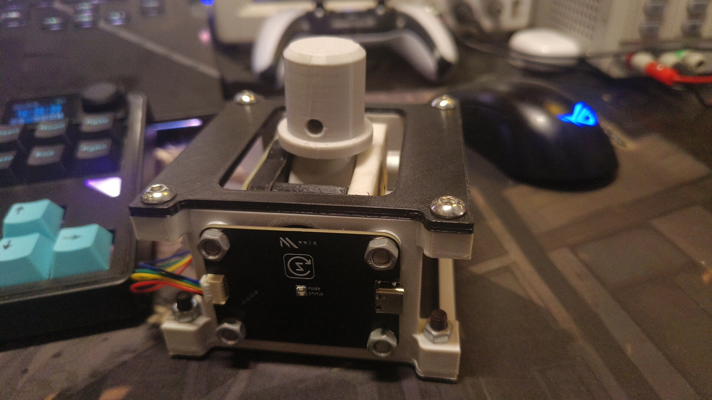
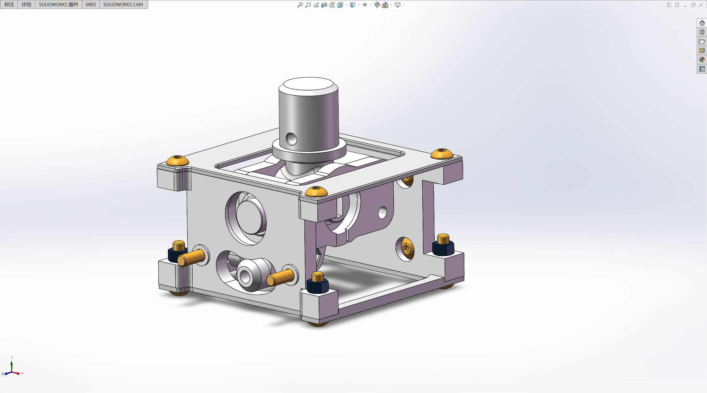
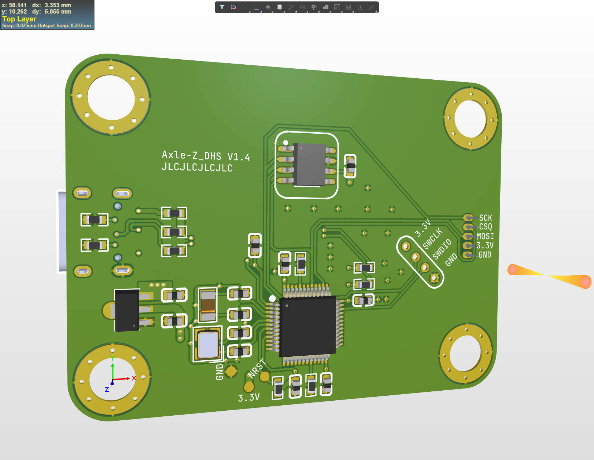

# JoystickFreeJoy

*基于 FreeJoy 固件的高精度双轴霍尔传感器 USB-HID 低成本 3D 打印摇杆方案*

本项目旨在为用户提供一种经济实惠易于实现的方式来构建自己的高精度摇杆控制器，适用于模拟器、游戏控制器等其它需要精确位置输入的场景。

通过霍尔传感器技术，通过检测磁场变化来精确地测量摇杆的位置，从而比传统电位器有更高的精度和更长的寿命。

# 项目特点

- 开源设计：本项目基于 MIT 协议开源，鼓励用户贡献或改进。
- 低成本：机械结构部分采用 3D 打印组件，便于制造和自定义生产。
- USB-HID：无需驱动即可实现游戏输入设备的模拟，即插即用。
- 高精度霍尔传感器：使用基于 SPI 通讯的高精度霍尔传感器 TLE5012BE100

# 许可证

本项目采用 MIT 许可证。有关详细条款，请参阅 LICENSE 文件。

# 源项目地址

本项目使用的固件和结构基于如下开源项目修改而来。

- **FreeJoy**：https://github.com/FreeJoy-Team/FreeJoy
- **底座机械结构**：https://www.thingiverse.com/thing:2496028

# 五金件

- 深沟球轴承 6802RS [15 * 24 * 5]mm * 4
- 深沟球轴承 MR105ZZ [5 * 10 * 4]mm * 10
- M5 * 10 蘑菇头内六角螺丝 * 8
- M5 * 20 蘑菇头内六角螺丝 * 4
- M5 * 20 沉头内六角螺丝 * 4
- M5 * 35 柱头内六角螺丝 * 4
- M5 螺母 * 若干 
 
# 烧录程序

1. 仓库提供了 freejoy 固件和 cfg 配置文件，烧录在 GUI 配置程序中导入配置文件即可使用。
2. PCB 上设计了一个使用间距 2.0mm 4P 的烧录针，通过 ST-Link Utility 烧录程序。

# 其它

1. 目前 Z 轴 (主控板) 的 PCB 基于 AD22 绘制，提供了源文件，Y 轴 PCB 基于嘉立创 EDA 绘制暂未提供源文件 (以后会转移到 AD 上提供到仓库)
2. 模型基于 Solidworks 2022 绘制，提供了源文件，后续会追加 STL 文件方便导入打印机打印。
